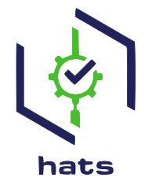

# SHIPS and HATS
----------------
 

### What is SHIP (Secure Hybrid Integrated Pipeline)?

About SHIP is a Continuous Integration and Continuous Deployment (CI/CD) platform solution for Whole of-Government (WOG).

By offering a common development platform, automating delivery of applications and simplifying policy clearance, SHIP establishes a consistent and automated way for continuous integration, continuous testing and delivery to create better quality products faster.

This is achieved through incorporating a Common Development Stack, Standard Build Management, and Centralised Release Management for application development in both external internet and internal WOG intranet environment:

 

### What is HATS (Hive Agile Testing Solutions)?
HATS is an Agile Quality Engineering tools that helps the organisation to:
- Create seamless and reliable automated testing on web and mobile applications;
- Execute tests in parallel so as to speed up execution time;
- Integrate into CI/CD pipelines so as to achieve continuous testing and frequent release; o Detect and remediate codes vulnerabilities and quality early.  