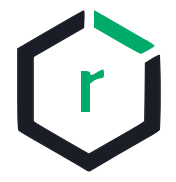

# Security Management
---------------------

## Identity and Connection Management

### Crowd

#### Centralized identity management for users from multiple directories
1. Single sign-on (SSO) to seamlessly log into your applications
2. Centralize multiple directories to manage users and authentication

For more information on Crowd, see https://www.atlassian.com/software/crowd

### OpenVPN
OpenVPN protects the CI/CD pipeline to ensure that your build process is secure from outside influence.

For more information on OpenVPN, see https://openvpn.net

***

## Nexus Products

### Nexus Repository Manager

#### Artifact Management across environments
1. Ensure that your development, build and production environments deploy consistent artifacts; Reduce errors due to differences in build artifacts.
2. Version control your release artifacts for better control and easier rollback.

For more information on Nexus Repository Manager, see https://www.sonatype.com/product-nexus-repository

### Nexus IQ
#### Open source library scanning
1. Scans open source libraries for all popular formats, including NPM, Nuget, Maven, Bowser and more.
2. Protect your deployments from the latest security risks exposed in your open source library usage.

For more information on Nexus IQ, see https://www.sonatype.com/nexus-iq-server