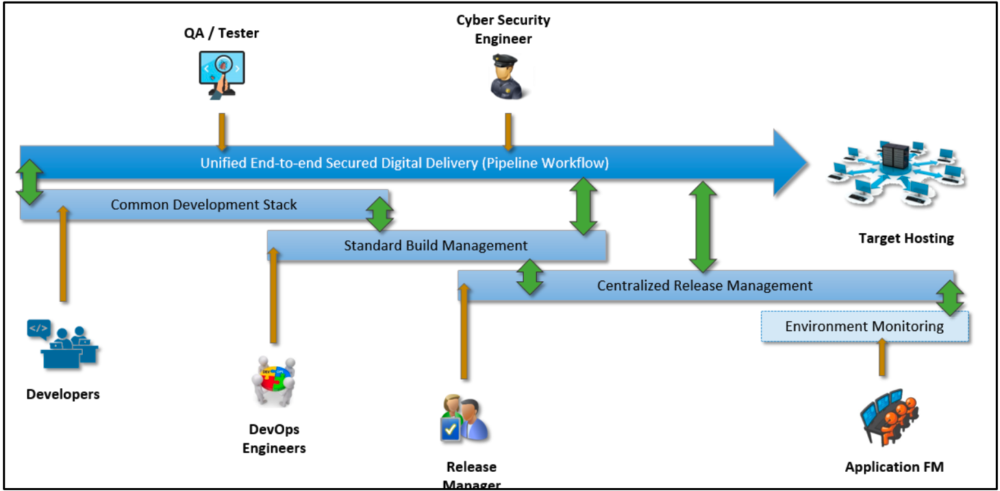

# More about SHIP

## i. Common Development Stack

Comprises of basic development tools for a development team to collaborate, perform project tracking, source code and binary management in a secure development environment. The objective is to allow development teams to perform tasks such as code review, branching strategy, product backlog grooming, development tracking and documentation in a collaborative manner.

## ii. Common Build Environment

Offers managed build engines, automated software builds to allow continuous integration and secure library management in an application’s lifecycle. This is essential to promote building from source using an independent standard build environment, building artifact management and driving policy-as-code development.

## iii. Release Management \(Upcoming\)

Offers continuous deployment and delivery to multiple target hosts and zones. It serves a centralised platform to build artifact review, release review, audit review, control release with authorization and authentication, release monitory and release configuration management.

Note: SHIP only provides the tools to support a CI/CD pipeline. Agencies/Tenants would still have to setup the pipeline themselves or through a vendor

